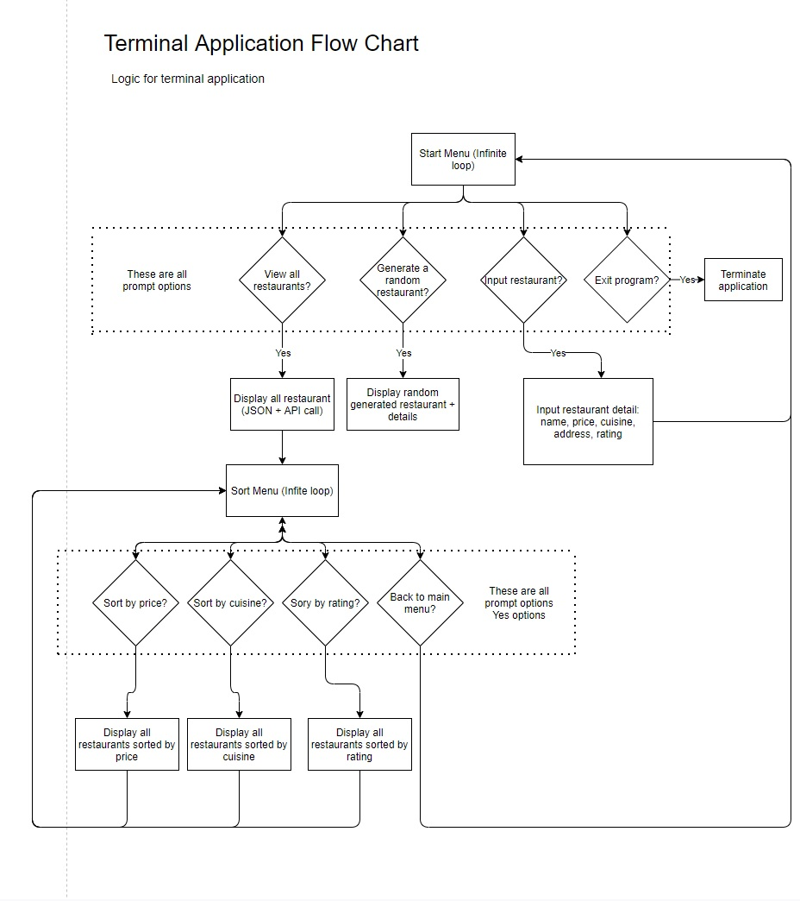

# Terminal App Assignment

## Installation and Setup

**Application is suitable for MAC and Linux users only**

1. Install Ruby, recommended using [asdf](https://asdf-vm.com/)

2. Install [Git](https://git-scm.com/downloads)

3. `git clone` to your home directory

```bash
git clone https://github.com/derricklai33/terminal_app.git ~/terminal_app
```

4. Run `setup` executable file

```bash
~/terminal_app/src/bin/setup
```

5. Open bash profile

```bash
# For MAC users:
open ~/.bash_profile
```

```bash
# For Linux users:
~/.profile
```

6. Add the following line

```bash
# For MAC users:
export PATH=$PATH:$HOME/terminal_app/src/bin
```

```bash
# For Linux users:
PATH=$PATH:$HOME/terminal_app/src/bin
```

7. Restart terminal to ensure `~/.bash_profile` or `~/.profile` is loaded into terminal

8. Run the `hungry` executable from anywhere in the terminal, include `-h` or `--help` flag for the help menu on other options

## Software Development Plan

Welcome to my 'What are we having tonight?' app! The initial plan for the terminal application was to be able to have a list of restaurants and be able to randomize a choice from the particular list as my partner and I usually have trouble deciding on a place to dine in for the night and why not let an app to help me do it?

The terminal application that I have developed is an application where users are able to browse for a list of restaurants generated from using Zomato's API and saved user input restaurants. The application also allows user to generate a randomize choice from the list of restaurants along with its details. The list of restaurants generated also includes details such as price for 2, type of cuisine, address of the restaurants and their respective ratings. Lastly, users are able to input their own restaurants into the list of restaurants that are already present and be able to save their input.

As the application utilizes an API GET request, the application is very dynamic and the information that it provide reflects the real time changes on Zomato's information of the restaurants. The application also utilizes a JSON file to be able to save user input restaurants and load the information onto the application as well. However, this means that user input restaurants has to be updated manually if there are certain changes to the details of the restaurants. Users are also able to sort all restaurants according to their price, type of cuisine and also ratings. Finally, with the main feature of the app that I had in mind, is to be able to generate a random choice of a restaurant along with its details. 

With all the above features, users are able to look up a list of restaurants to compare prices, type of cuisines, ratings and also having the location to determine if the restaurants are close by or far away. If users are unsure of where to dine in after all the comparison, they are able to just randomize a choice of restaurant by using the "Generate a random restaurant" feature. The application is useful for anyone that is indecisive as I am on where to have a meal.

## Features

1. Zomato API call

The Zomato API call utilizes a GET request using HTTParty gem which enables the terminal application to get a return of json string in hash formats that includes all of the information that Zomato has on different restaurants in Melbourne. The limitations of the Zomato API are that it only allow GET request of 20 restaurants per request and only up to 100 restaurants. The application utilizes 5 GET request chained in an array to suit HTTParty request format and is only able to request up to 100 restaurants, in descending order of the most expensive restaurants in Melbourne.

2. User input restaurant and saving in JSON file

With the Zomato API's limitation in mind, additional restaurants can be manually inputted by users and are stored in a JSON file to save user inputted restaurants and are able to be called and referenced with the list of restaurants generated from the API call. This would also enable more freedom with the choice of restaurants as the API calls are very limited in terms of being able to display more than 100 restaurants.

3. Randomize a restaurant from list of restaurants

The last feature of this application is be able to generate a randomize restaurants from the list of restaurants (both API call and user inputted restaurants). By utilizing a `.sample` method call on the array of API call and user input restaurants, it returns the details of the particular random restaurant and be able to display the name, price, cuisine, address and ratings for the restaurant. 

## User interaction outline

If installations of gemfiles and executables setup were done correctly, users are able to type in `hungry` in the terminal and the terminal application will launch. Users are also able to pass in flags such as `hungry -v, --version` for the current version of the application, `hungry -h, --help` for the help menu and also `hungry -r, --random` to directly generate a random restaurant without interacting through the user menu.

Upon entering `hungry` in the terminal, a user menu in an infinite loop with options of `View all restaurants`, `Pick a random restaurant!`, `Input new restaurants` and `Exit`, displayed using tty prompt. The use of tty prompt is to ensure that user interactions at the start menu are straightforward, easy to use and error free. Users can cycle through the menu options using their up and down arrow key and Enter key to decide on which options to explore. With the benefits/restriction of tty prompt, no errors will occur.

- `View all restaurants` option

If users selected the `View all restaurants` option, the application will load all of the listed restaurants from the API call and also user inputted restaurants in a table format by utilizing terminal-table rubygem. Users are then prompted with the sorting menu loop, with 4 more options, `Sort according to price`, `Sort according to cuisine`,`Sort according to rating` and `Back to main menu`, which are also tty prompts.

`Sort according to price` will sort the table of restaurants from most expensive to the cheapest restaurants in order. Users are then brought back to the sorting menu.

`Sort according to cuisine` will sort the the table of restaurants in alphabetical order from A to Z. Users are then brought back to the sorting menu.

`Sort according to rating` will sort the table of restaurants from highest rating (5.0) to the lowest rating (0.0). Users are then brought back to the sorting menu.

`Back to main menu` will exit the current menu selection back to the main menu options. 

- `Pick a random restaurant!` option

If users selected this option, the application will generate a random restaurant from the list of restaurants with details and will display like so:

```
Your random choice of restaurant today is: Estelle Bistro
Details:
Price for 2: 150
Type of cuisine: European
Address: 243 High Street, Northcote, Melbourne
Rating: 4.5
```
The user is then brought back to the main menu loop.

- `Input new restaurants` option

If users selected this option, users are prompted to enter the name of restaurant, price to dine in the restaurant for 2 person, the address of the restaurant and the rating that the user decides for the restaurant. Errors such as inputting empty restaurant names, invalid prices and ratings and also empty address are handled in code to delete them. Users are also prompted with the correct way of inputting restaurant details to minimize errors. 

- `Exit` option

Exits the application

## Control Flow



## Project Management

I have used Trello to manage my project.

Here is a link to my [Trello board](https://trello.com/b/fFHzLUYA/terminal-app).

## RSpec test

To run the RSpec tests, cd into `~/terminal_app/src` using

```bash
cd ~/terminal_app/src
```

After cd-ing into `~/terminal_app/src`, run the following command to perform tests

```bash
rspec -fd
```
The command will show the title of test and whether if they pass or fail.

## References

[Zomato API](https://developers.zomato.com/api)

[Flowchart - Drawio](draw.io)